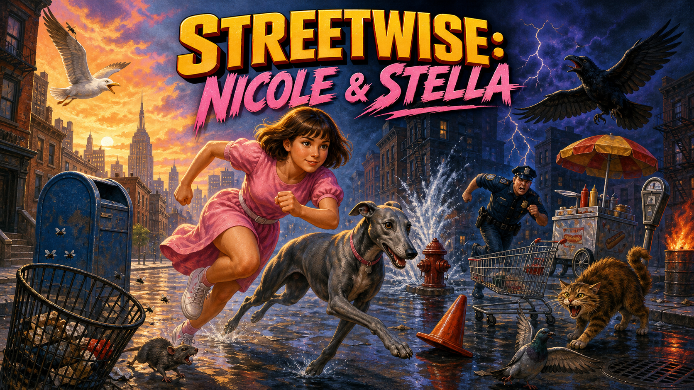

# Streetwise: Nicole & Stella



A 16-bit-style side-scroller game built with [Phaser 4](https://phaser.io/) and [Vite](https://vitejs.dev/).

## Stack

- **Phaser 4** — 2D game framework (sprites, animation, arcade physics, scenes)
- **Vite** — dev server and build tool

## Getting started

```bash
npm install
npm run dev
```

Open the local URL Vite prints (usually `http://localhost:5173`).

## Art reference

All sprites are drawn procedurally at runtime (no image assets). The
**Art Read-Check** is a self-contained page that renders every obstacle,
pickup and character from its exact pixel data, blown up and animated, with
a legibility note and status on each. It ships with the site build.

- **Live:** <https://mtmangum.github.io/Streetwise/art-read-check.html>
- **Locally:** open `public/art-read-check.html` in a browser (no build step)

## Controls

- **Space / click / tap** — jump immediately, or start/restart the game
- **Double-tap** — power jump when the power meter is ready
- **P / Escape / Pause button** — pause or resume
- **Start menu** — tap the Normal or Easy (Nicole) card to play in that mode, or use ← → / E to highlight one and Space / Enter to start; the choice is remembered

## Project structure

```
index.html          Mounts the game, no game logic
src/
  config.js           Tunable constants (sizes, gravity, scroll speed,
                       colors, parallax layout, health tuning)
  main.js              Phaser boot and game config
  audio/
    ChiptuneAudio.js      Generated 8-bit soundtrack and sound effects
  gfx/
    playerFrames.js      Procedural pixel-art part/pose data for the player
    dogFrames.js           Procedural pixel-art part/pose data for the dog
    healthColor.js          Red -> orange -> yellow -> green health bar ramp
    dayNightPalette.js       Sky/hill/ground/sun/moon interpolation by dayPhase
  scenes/
    BootScene.js         Generates all textures + player/dog animations, hands off to Play
    PlayScene.js          Game loop: scrolling ground/scenery, obstacle
                           spawning, health bar, collisions, game over/restart
  entities/
    Player.js              Player sprite wrapper (physics body, jump,
                            animation, stumble/fall/get-up)
    Dog.js                  Companion greyhound with a delayed forward jump arc
    Obstacle.js             Weighted day/night hazards and collision behavior
    Pigeon.js               Super-jump health-boost target
    Seagull.js              Rare full-life target
    Crow.js                 Hostile aerial hazard
    Parallax.js             Sky, sun/moon, brownstones, clouds scenery layer
```

## Current state

The player is a procedurally-drawn, animated 16-bit-style chibi sprite — big
head, brown bob haircut, pink dress — with shaded, outlined idle/walk/jump poses plus a
stumble/fall/get-up sequence played on hit (see `src/gfx/playerFrames.js`
and `Player.js`). She's trailed by a cosmetic companion greyhound
(`Dog.js`, `src/gfx/dogFrames.js`) whose run cycle alternates a gathered
and a fully-extended pose — the real "double suspension gallop" a
greyhound runs in — and which echoes her jumps after a delay computed from
how long the same obstacle takes to travel from her position to the dog's
at the current scroll speed (not a flat delay - see "The dog's jump delay
is computed" in `HANDOFF.md`).

Each run plays out one full day -> night arc over 90 seconds, driving the
sky, sun/moon, pavement, scenery, and obstacle roster. Layered brownstones
include varied facades, fire escapes, roof tanks, parked cars, and walking
pedestrians. Day hazards include hydrants with arcing water, shopping
carts, food carts, parking meters, crates, cones, mailboxes, trash bins,
and boomboxes. Night adds burning barrels, steam stacks, garbage bags with
a rat, cats, cops, streetwalkers, and sleeping street figures. Spawn
phrasing mixes clusters with deliberate quiet beats and never repeats the
same obstacle family twice in a row.

The first 20 seconds form an easier onboarding stretch with widely spaced,
stationary obstacles and no birds. Difficulty then ramps through tighter
spacing, moving carts, faster scrolling, aerial hazards, and day/night
roster changes. Cops chase briefly after Nicole clears them.

There's no numeric score. Life force slowly drains during play, rises by
eight points when an obstacle is cleared, and can extend past 100% into a
textured, sparking overcharge zone. A floating `+8` token makes each reward
visible. Super-jumping into a pigeon grants a 35-point boost; the much
rarer seagull fills the complete bar. Black birds cause an aerial tumble
and heavy damage. An empty bar ends the run.

Music and effects are synthesized in real time by Web Audio: a looping
square-wave chiptune accompanies distinct jump, super-jump, reward, bird,
damage, and game-over sounds. Audio begins with the first gameplay input
to comply with browser autoplay rules.

## Deployment

Pushing to `main` triggers `.github/workflows/deploy.yml`, which builds
the project and publishes `dist/` to GitHub Pages automatically.

One-time setup in the GitHub repo: **Settings → Pages → Source → GitHub
Actions**. After that, every push to `main` redeploys.

The site will be served at `https://<your-username>.github.io/Streetwise/`.
If you rename the repo, update `base` in `vite.config.js` to match.

## Roadmap

- [x] Animated player sprite (idle / walk / jump / stumble)
- [x] Parallax background layers
- [x] Obstacle variety, split day/night
- [x] Health bar with overcharge (replaces numeric score)
- [x] Day -> night run arc with matching scenery
- [x] Companion greyhound
- [x] Foreground street activity and parked-car parallax
- [x] 8-bit soundtrack and sound effects
- [x] Power jump with aerial rewards and hazards
- [x] Pause/resume controls
- [x] Easy (Nicole) mode: slower world, wider obstacle spacing, softer hits
- [x] Christmas theme: snowy brownstones with string lights and wreaths, falling snow, Santa hats, and a rain-to-sleet-to-snow storm that leaves snow on the street
- [x] Stella's Protective Leap (one crow dive intercepted per run)
- [x] Coffee power-up (slows the world for five seconds)
- [x] Stella Bark Blast power-up (scares off birds, cats, rats and cops on screen)
- [ ] Local high-score storage (e.g. best dodge streak)
